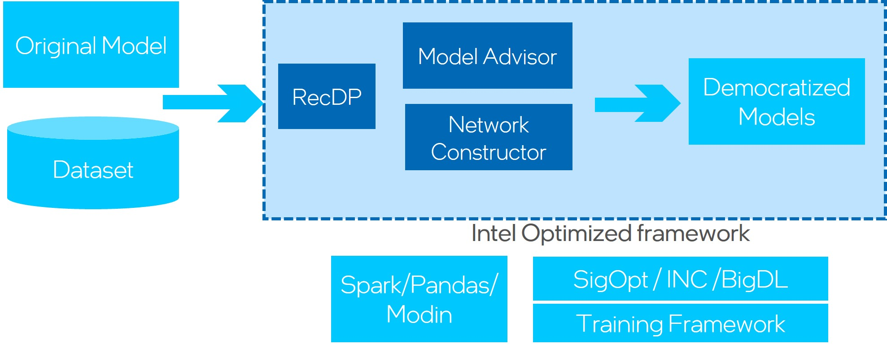
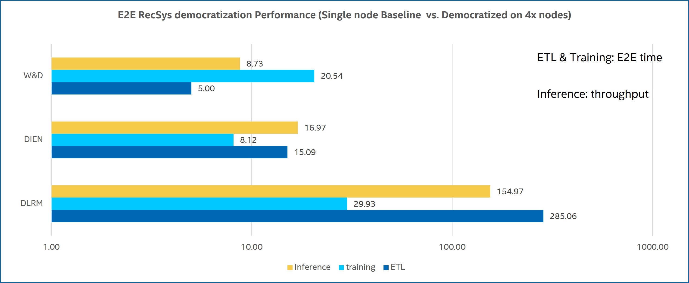

# [Intel® End-to-End AI Optimization Kit](https://laughing-waddle-b1e4ead5.pages.github.io/html/)

Intel® End-to-End AI Optimization Kit (code name AIDK) is a set of kits for E2E AI democratization on CPU. It is a pipeline framework that streamlines AI democratization technologies in each stage of E2E AI pipeline, including data processing, feature engineering, training, hyper-parameter tunning, and inference. Intel® End-to-End AI Optimization Kit delivers high performance, lightweight models efficiently on commodity hardware. 

# Introduction

Modern end to end machine learning or deep learning system usually includes a lifecycle of data processing, feature engineering, training, inference and serving. Each different stage might has different challenges, for example, the data to be processed might be huge, and thus require a signficant amount of time to process the data and the data ETL and pre-processing time often take much more time than training. For feature engineering phase, usually numerous sets of new features need to be created, and then tested for effectiveness. For model training, one of the entry barrier is the model could be quite complex and usually requires lots of expertise to design, understand, tune and deploy the models. What makes things worse is one usually needs to repeate the experiements of the ETL, feature engineering, training and evaluation process for many times on many models, to get the best model, which requires signficant amount of computational resources and is time-consuming. 

# End-to-End AI democratization 

One approach to resolve those challenges is AI democratization, which trying to make AI accessabile & affordable to every organization and every data scientist. There are a lot of things to be democratized, including: 
1. Data accessibility & quality, where you make the data access easier and simpler; building a data platform to democratize the data management - simplify data ingestion, data explore, processing and visulaization. 
2. Storage and compute platforms, instead of running the AI on hi-cost GPU, run it on commodity hardware with auto-scaling. 
3. Algorithms - Democratize the use, development and sharing of ML & DL algorithms; reduce the entry barrier with automatic neural architecture search and AutoML. 
4. Model development - select the most suitalbe models for users, democratize the end to end model development. 
5. Market place - simply how you access, use, exchange and monetization of data, algorithm, models, and outcomes. 

# Intel® End-to-End AI Optimization Kit 

Intel® End-to-End AI Optimization Kit, is a set of toolkits to democratize E2E AI on commdity hardware. The strategy is to bring E2E AI to existing commdity hardware, i.e., CPU installation base with good-enough performance at zero additional cost, it drives the CPU/GPU balance in E2E AI, unifies the pipelien on one infrastructure and eliminated uncessary data movement across different clusters. The core componements of Intel® End-to-End AI Optimization Kit are: model advisor and  network constructor. Model advisor provides build-in intelligence to generate parameterized models, while network constructor leverages domain-specific train-free NAS to generate domain-specific models. 

# Architecture 

Below firgure showed the architecture diagram of Intel® End-to-End AI Optimization Kit. 

# Major Componments 

Here are the major componments of Intel® End-to-End AI Optimization Kit: 
1. RecDP -  scalable data processing and feature engineering kit based on Spark, and can be extended to other tools like Modin.  
2. Smart Democratization Advisor - a human intelligence enhanced toolkit to generate sigopt recipes for Sigopt AutoML. It first generate optimized SigOpt recipes based on user choices and built-in intelligence, including optimized model parameters, optimized training framework parameters and set the training cluster environment, training framework parameters, and final target metrcis. Then it kicks off Siopt AutoML for optimization experiments to generate the best model. 
3. Network Constructor - A multi-model, hardware-aware, train-free NAS based componment to constructs domain-specific compact models. 

# In-Stock-Models

Currently four recommender system workloads were supported: including DLRM, DIEN, WnD and RecSys. Intel® End-to-End AI Optimization Kit significantly improved the performance of those models on distributed CPU cluster, reduced the performance gap of CPU to GPU from 100x to < 2x, using the same dataset and the same AUC metrics.  

# Perforamnce 
. 

# How To Use

[QuickStart](docs/source/quickstart.rst)
[Create New Advisor](docs/source/advanced.rst)

# How to Contribute

[Documenting Style](docs/source/documentingstyle.rst)
[Coding Style](docs/source/codingstyle.rst)
